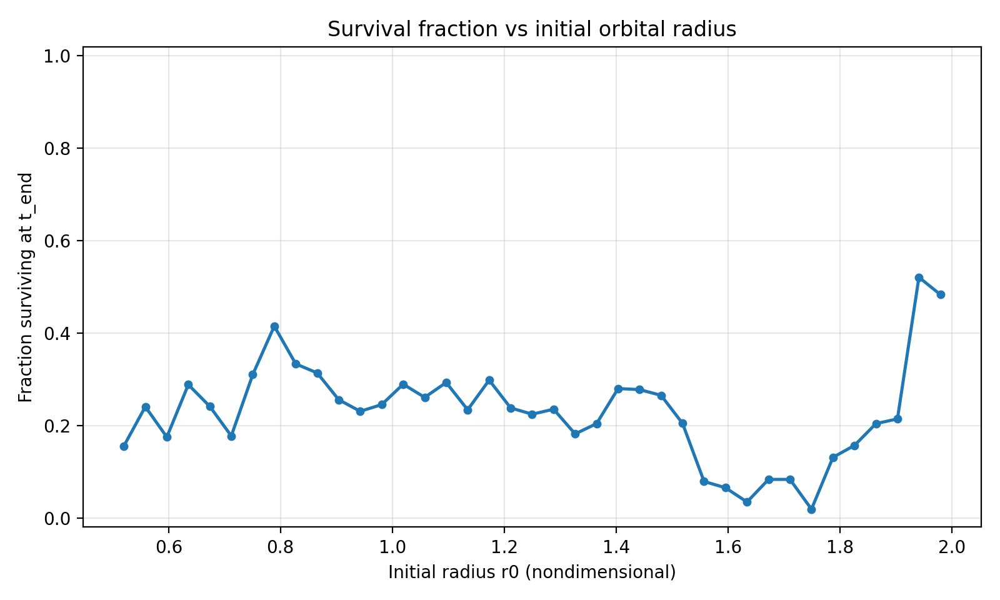
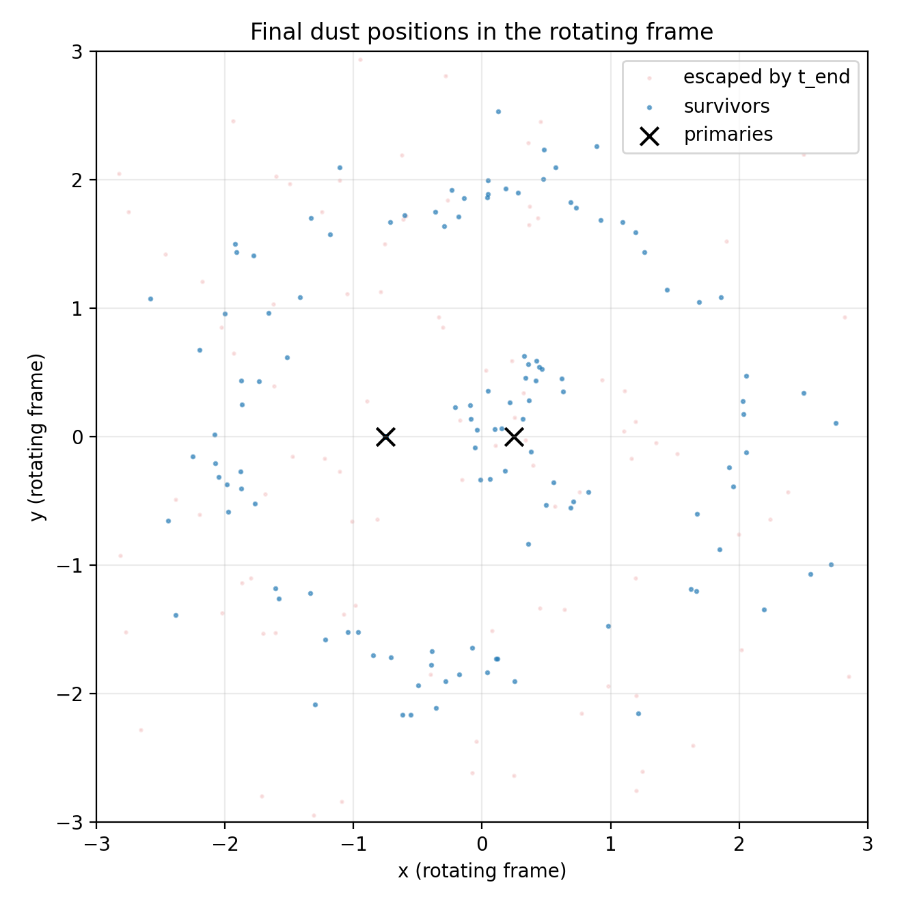

# Dust Clearance in a Rotating Binary (UCSB Physics)

**Author:** Hongyu Wang  
**Instructor:** David Berenstein  
**Date:** June 4, 2024

## Question
How can **mean-motion resonances** in a two-body (binary / star–planet) system destabilize test-particle orbits and create “gaps” in the distribution of dust/asteroids?

## Model (what’s simulated)
- Two primaries of masses **M1=1**, **M2=3** on a fixed circular orbit of separation **D=1** (nondimensional units, **G=1**).
- Thousands of massless test particles (“dust”) with random initial radii and phases.
- Newtonian gravity only (no dust-dust collisions, gas drag, or radiation pressure).

## Method
- Integrate trajectories with a fixed-step **RK4** integrator.
- Mark a particle as “escaped” if its radius exceeds `max_radius` at any step.
- Record the random seed and all run parameters so results are reproducible.

## Key results
### Survival fraction vs initial radius


### Final positions in the co-rotating frame


## Reproduce
```bash
# from the repository root
python -m venv .venv
source .venv/bin/activate
pip install -r requirements.txt

python src/simulate_dust.py --n_particles 2000 --steps 2000 --dt 0.02 --seed 42
python src/make_figures.py
```
Figures are written to `figures/` and the simulation output is saved to `outputs/sim_results.npz`.

## Repository structure
```text
.
├── src/
│   ├── simulate_dust.py
│   └── make_figures.py
├── outputs/
│   └── sim_results.npz
├── figures/                # auto-generated
├── report/                 # LaTeX source + compiled PDF
└── summary/                # one-page, non-technical summary
```

## Writing sample
- Full technical report: `report/report.pdf`
- One-page non-technical summary: `summary/one_page_summary.pdf`
