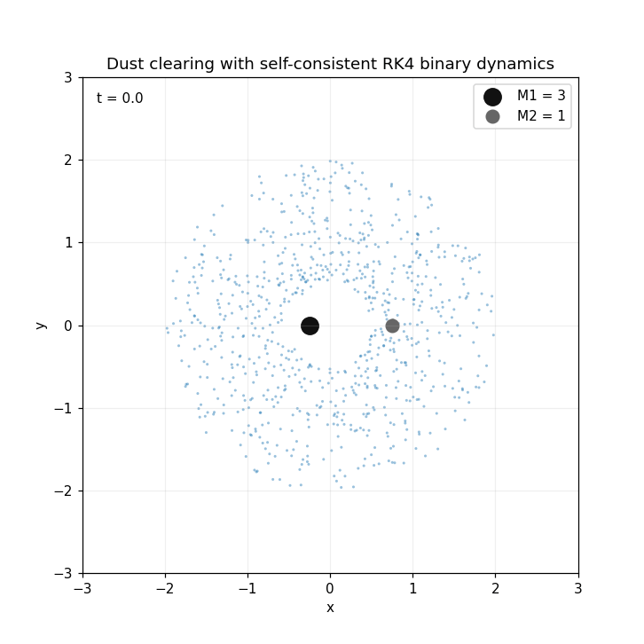
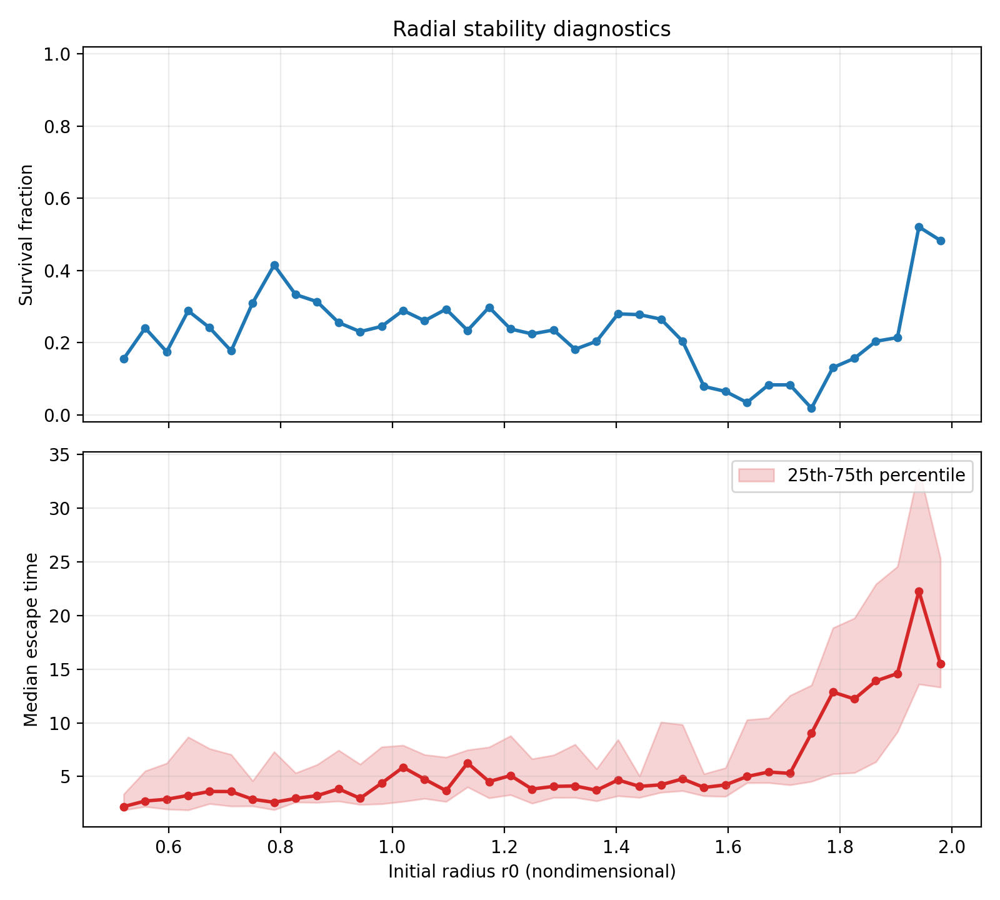
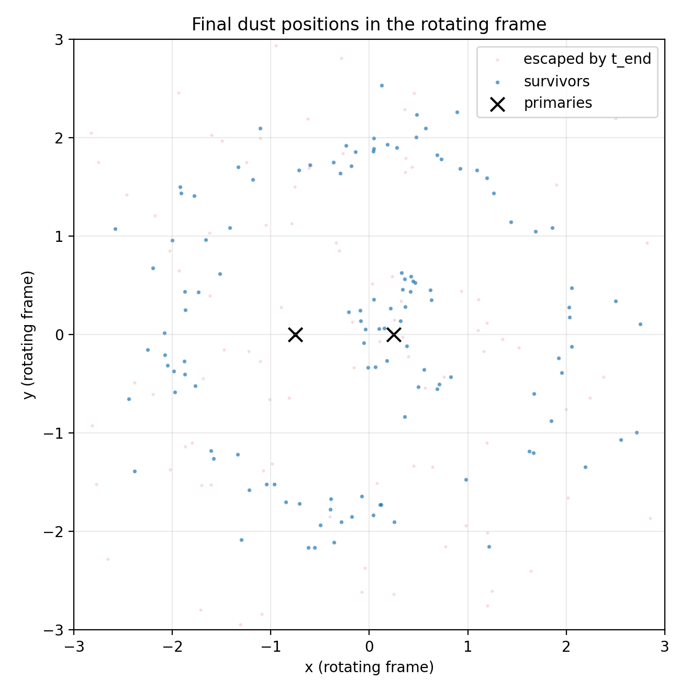

# Dust Clearance in a Rotating Binary

A reproducible Python project built from a UCSB physics final project on
**resonance-driven dust clearing** in a rotating binary system.

This repository is structured as a small simulation-and-analysis codebase rather
than a report dump: it generates the raw simulation output, derives binned
stability diagnostics, and exports both static figures and a GitHub-friendly
animation.

## What this repository demonstrates

- vectorized **NumPy** simulation of thousands of test particles
- a custom fixed-step **RK4** integrator for a time-dependent gravitational field
- derived **data products** (`CSV` and `JSON`) from simulation output
- scientific visualization with **matplotlib**
- animated result generation for a portfolio-ready **README GIF**
- a reproducible workflow that connects code, figures, and report artifacts

## Key results

For the default run (`n_particles=2000`, `steps=2000`, `dt=0.02`, `seed=42`):

| Quantity | Result |
|---|---:|
| Particles simulated | `2000` |
| Surviving particles at `t_end` | `461` |
| Escaped particles at `t_end` | `1539` |
| Overall survival fraction | `0.2305` |
| Median escape time | `4.86` |
| Most unstable initial radius bin | `r0 ~= 1.749` |
| Minimum survival fraction | `0.0189` |

Interpretation:

- Stability depends strongly on the particle's **initial orbital radius**
- The deepest depletion in this run occurs near **`r0 ~= 1.75`**
- The system shows **radial "danger zones"** consistent with resonance-driven clearing

## Orbit evolution (README animation)

The animation below is generated from downsampled trajectory snapshots saved by
the simulation and rendered in the co-rotating frame.



## Static analysis outputs

### Instability diagnostics

This figure combines two analysis views:

- top: survival fraction vs initial radius
- bottom: median escape time of escaped particles vs initial radius



### Final positions in the rotating frame



## Data products written by the pipeline

The repository now writes structured outputs in addition to figures:

- `outputs/sim_results.npz`
  downsampled trajectory history, final positions, survival mask, escape times,
  and run parameters
- `outputs/radial_diagnostics.csv`
  radius-binned survival and escape-time summary
- `outputs/analysis_summary.json`
  headline metrics suitable for reports or dashboards

## Reproduce the analysis

```bash
python -m venv .venv
source .venv/bin/activate   # Windows: .venv\Scripts\activate
pip install -r requirements.txt

python src/simulate_dust.py --n_particles 2000 --steps 2000 --dt 0.02 --seed 42 --save_every 20
python src/make_figures.py
python src/make_animation.py --max_particles 800 --fps 12 --dpi 110
```

Generated assets are written to:

- `figures/survival_fraction_vs_initial_radius.png`
- `figures/instability_diagnostics.png`
- `figures/final_positions_rotating_frame.png`
- `figures/orbit_evolution.gif`

## Repository structure

```text
.
|-- src/
|   |-- simulate_dust.py
|   |-- make_figures.py
|   `-- make_animation.py
|-- outputs/
|   |-- sim_results.npz
|   |-- radial_diagnostics.csv
|   `-- analysis_summary.json
|-- figures/
|   |-- survival_fraction_vs_initial_radius.png
|   |-- instability_diagnostics.png
|   |-- final_positions_rotating_frame.png
|   `-- orbit_evolution.gif
|-- report/
|   |-- report.tex
|   `-- final_project_129_updated.pdf
`-- summary/
    |-- one_page_summary.tex
    `-- one_page_summary.pdf
```

## Project origin

This repository is adapted from a UCSB physics course final project. The goal of
the GitHub version is to present the work as a **reproducible numerical-analysis
project** with clear data products, visual diagnostics, and readable Python.
